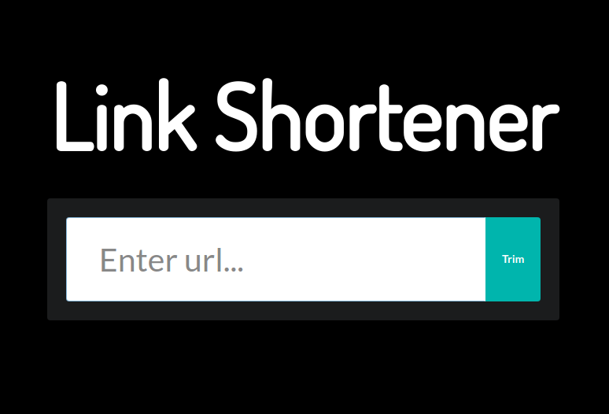

# Shortena
An url shortener seo friendly

This is a link trimmer and the first application i built using next.js, this first version simply shortens urls and lets you 
copy into clipboard the output url for sharing.

<p align="center">
  
</p>

<table>
  <tr>
    <td></td>
    <td></td>
    <td></td>
    <td></td>
  </tr>
</table>

## How to run it ?

First, clone the repo:

```console
foo@bar:~$ git clone https://github.com/wwleak/shortena.git
```

Then install all the dependencies

```console
foo@bar:~$ npm i
```

Then install nodemon

```console
foo@bar:~$ npm i -g nodemon
```

Finally you can start the application by running 

```console
foo@bar:~$ npm run dev
```

<p align="right">MADE WITH ❤ BY ABRAHAM</p>

